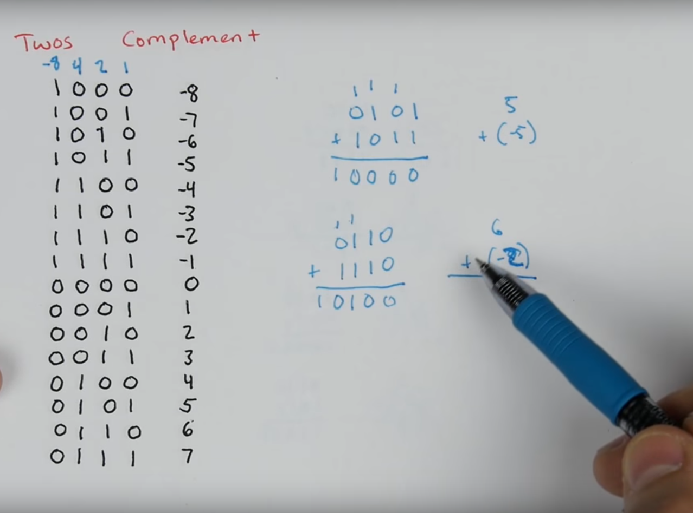
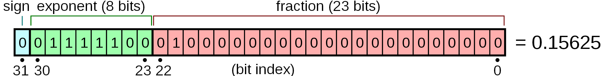
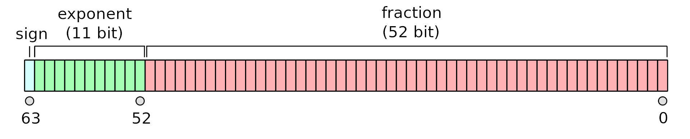
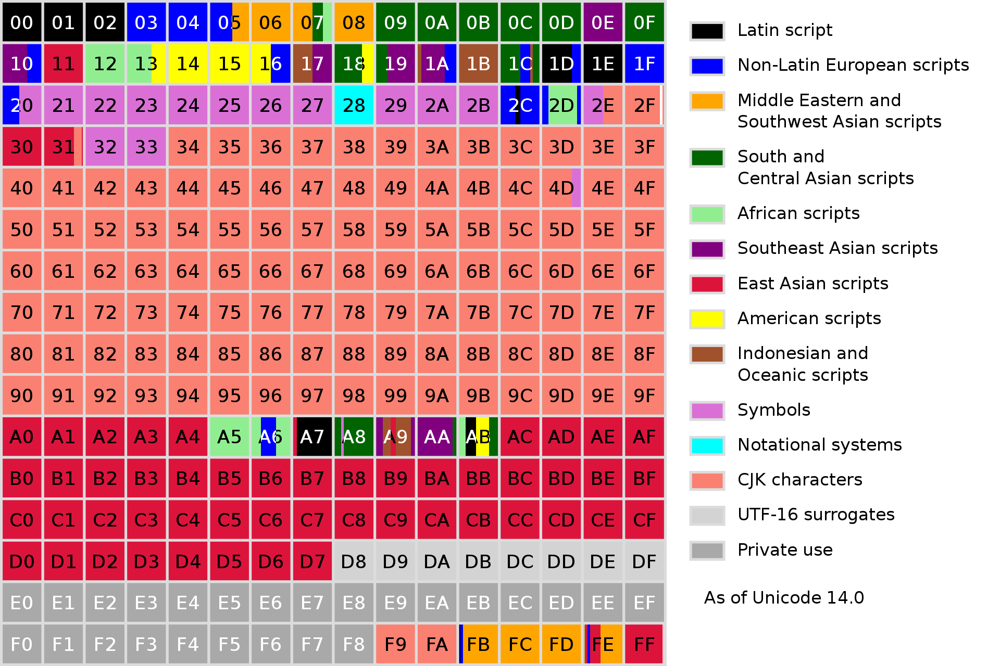
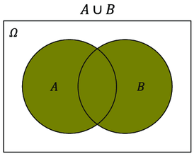
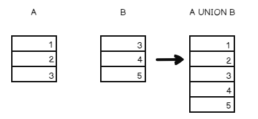
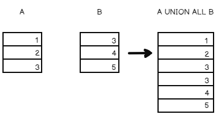
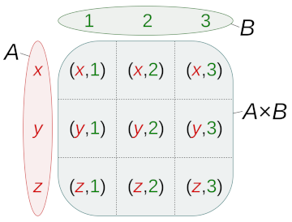
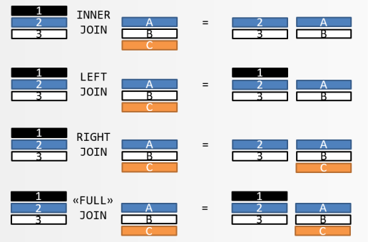
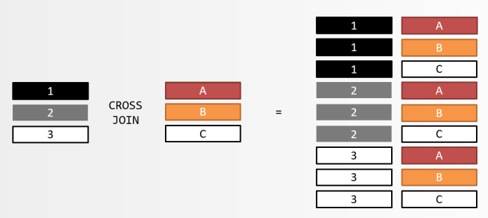

# SQL Crash Course: MySQL for Developers and Data Analyst

## 1. Introduction to databases

### Installation guide

#### Links:

[Download Mysql and Mysql workbench here](https://dev.mysql.com/downloads/)

[Fedora guide](https://docs.fedoraproject.org/en-US/quick-docs/installing-mysql-mariadb/)

[MacOS guide](https://dev.mysql.com/doc/refman/8.0/en/macos-installation-pkg.html)

[Windows guide](https://dev.mysql.com/doc/refman/8.0/en/windows-installation.html)

[Apt repos guide (Ubuntu, Debian)](https://dev.mysql.com/doc/mysql-apt-repo-quick-guide/en/)

[Docker MySQL image](https://hub.docker.com/_/mysql/)

_______

### A glance at the Workbench

#### Links:

[The Absolute Minimum Every Software Developer Absolutely, Positively Must Know About Unicode and Character Sets (No Excuses!)](https://www.joelonsoftware.com/2003/10/08/the-absolute-minimum-every-software-developer-absolutely-positively-must-know-about-unicode-and-character-sets-no-excuses/)

_______
### Data Normalization

#### Links:

[Database normalization](https://en.wikipedia.org/wiki/Database_normalization)

### SQL and RDBMS

_______
## 2. DDL = Data Definition Language

### DDL review, CREATE DATABASE
### [Pull Request](https://github.com/nickovchinnikov/sql-box/pull/1)

#### Links:

[Character Sets and Collations in General](https://dev.mysql.com/doc/refman/8.0/en/charset-general.html)

[UTF8 string comparisons in MySQL stackoverflow](https://stackoverflow.com/questions/7023541/utf8-string-comparisons-in-mysql)

[Create Database](https://dev.mysql.com/doc/refman/8.0/en/create-database.html)

_______

### CREATE TABLE intro
### [Pull Request](https://github.com/nickovchinnikov/sql-box/pull/2)

#### Links:

[CREATE TABLE Statement](https://dev.mysql.com/doc/refman/8.0/en/create-table.html)

[The utf8mb4 Character Set (4-Byte UTF-8 Unicode Encoding)](https://dev.mysql.com/doc/refman/8.0/en/charset-unicode-utf8mb4.html)

_______

### Integers

### [Pull Request](https://github.com/nickovchinnikov/sql-box/pull/26)

#### Links:

[Numeric Data Types](https://dev.mysql.com/doc/refman/8.0/en/numeric-types.html)

[YouTube: Twos complement: Negative numbers in binary](https://www.youtube.com/watch?v=4qH4unVtJkE)
_______

### Floating-point numbers, exact precision and BIT

### [Pull Request](https://github.com/nickovchinnikov/sql-box/pull/27)

#### Links:

[Single-precision floating-point format](https://en.wikipedia.org/wiki/Single-precision_floating-point_format)

[Double-precision floating-point format](https://en.wikipedia.org/wiki/Double-precision_floating-point_format)

[Floating Point Numbers - Computerphile](https://www.youtube.com/watch?v=PZRI1IfStY0)

[Floating Point Numbers (Part1: Fp vs Fixed) - Computerphile](https://www.youtube.com/watch?v=f4ekifyijIg)

[Floating Point Numbers (Part2: Fp Addition) - Computerphile](https://www.youtube.com/watch?v=782QWNOD_Z0)

_______

### UTF8MB4 Character Set, Collation Explained

### [Pull Request](https://github.com/nickovchinnikov/sql-box/pull/28)

Below is the full list of new collations added so far in MySQL 8.0.0

#### The convention used here is:

* Character-set name (utf8mb4)
* Language identifier (de,is etc)
* Unicode version (0900)
* Accent and case sensitivity (ai_ci means case and accent insensitive)

| Collation                  |
|----------------------------|
| utf8mb4_0900_ai_ci         |
| utf8mb4_de_pb_0900_ai_ci   |
| utf8mb4_is_0900_ai_ci      |
| utf8mb4_lv_0900_ai_ci      |
| utf8mb4_ro_0900_ai_ci      |
| utf8mb4_sl_0900_ai_ci      |
| utf8mb4_pl_0900_ai_ci      |
| utf8mb4_et_0900_ai_ci      |
| utf8mb4_es_0900_ai_ci      |
| utf8mb4_sv_0900_ai_ci      |
| utf8mb4_tr_0900_ai_ci      |
| utf8mb4_cs_0900_ai_ci      |
| utf8mb4_da_0900_ai_ci      |
| utf8mb4_lt_0900_ai_ci      |
| utf8mb4_sk_0900_ai_ci      |
| utf8mb4_es_trad_0900_ai_ci |
| utf8mb4_la_0900_ai_ci      |
| utf8mb4_eo_0900_ai_ci      |
| utf8mb4_hu_0900_ai_ci      |
| utf8mb4_hr_0900_ai_ci      |
| utf8mb4_vi_0900_ai_ci      |

#### Basic Multilingual Plane (BMP):

#### Links:

[Plane (Unicode)](https://en.wikipedia.org/wiki/Plane_(Unicode))

[The utf8mb4 Character Set (4-Byte UTF-8 Unicode Encoding)](https://dev.mysql.com/doc/refman/8.0/en/charset-unicode-utf8mb4.html)

[New collations in MySQL 8.0.0 ](https://dev.mysql.com/blog-archive/new-collations-in-mysql-8-0-0/)

[MySQL 8.0 Collations: The devil is in the details](https://dev.mysql.com/blog-archive/mysql-8-0-collations-the-devil-is-in-the-details/)

[Unicode Collation Algorithm](https://unicode.org/reports/tr10/#Default_Unicode_Collation_Element_Table)

_______

### VARCHAR, TEXT, CHAR

### [Pull Request](https://github.com/nickovchinnikov/sql-box/pull/29)

#### Links:

[String Data Types](https://dev.mysql.com/doc/refman/8.0/en/string-types.html)

[The CHAR and VARCHAR Types](https://dev.mysql.com/doc/refman/8.0/en/char.html)

[Limits on Table Column Count and Row Size](https://dev.mysql.com/doc/refman/8.0/en/column-count-limit.html)

[String Type Storage Requirements](https://dev.mysql.com/doc/refman/8.0/en/storage-requirements.html#data-types-storage-reqs-strings)

[Specifying Character Sets and Collations](https://dev.mysql.com/doc/refman/8.0/en/charset-syntax.html)

_______

### Date and Time

### [Pull Request](https://github.com/nickovchinnikov/sql-box/pull/31)

#### Links:

[Date and Time Data Types](https://dev.mysql.com/doc/refman/8.0/en/date-and-time-types.html)

[Unix time](https://en.wikipedia.org/wiki/Unix_time)

_______

## 3. Indexes and Keys

### Binary Search, B-trees and Keys

#### Links:

[Binary Search Animation by Y. Daniel Liang](https://yongdanielliang.github.io/animation/web/BinarySearchNew.html)

[B-trees visualization](https://liveexample.pearsoncmg.com/dsanimation13ejava/BSTeBook.html)

[How MySQL Uses Indexes](https://dev.mysql.com/doc/refman/8.0/en/mysql-indexes.html)
_______

### Primary and Unique keys

### [Pull Request](https://github.com/nickovchinnikov/sql-box/pull/6)

#### Links:
[CREATE TABLE Statement](https://dev.mysql.com/doc/refman/8.0/en/create-table.html)
_______

### Foreign keys

### [Pull Request](https://github.com/nickovchinnikov/sql-box/pull/8)

#### Links:

[FOREIGN KEY Constraints](https://dev.mysql.com/doc/refman/8.0/en/create-table-foreign-keys.html)
_______

### ALTER STATEMENT

### [Pull Request](https://github.com/nickovchinnikov/sql-box/pull/9)

#### Links:

[ALTER TABLE Statement](https://dev.mysql.com/doc/refman/8.0/en/alter-table.html)

[ALTER DATABASE Statement](https://dev.mysql.com/doc/refman/8.0/en/alter-database.html)
_______

## 4. Workbench and EER (Enhanced Entity-Relationship) diagrams

### EER diagram with Workbench

### [Pull Request](https://github.com/nickovchinnikov/sql-box/pull/10)
___

### Export DDL from EER

### [Pull Request](https://github.com/nickovchinnikov/sql-box/pull/11)
___

### Import and Backup

### [Pull Request](https://github.com/nickovchinnikov/sql-box/pull/12)
___

## 5. DML = Data Manipulation Language

### Insert

### [Pull Request](https://github.com/nickovchinnikov/sql-box/pull/13)
___

### SELECT and WHERE review

### [Pull Request](https://github.com/nickovchinnikov/sql-box/pull/14)

#### Links:

[Employees test DB github](https://github.com/datacharmer/test_db)

[SELECT Statement](https://dev.mysql.com/doc/refman/8.0/en/select.html)
___

### Comparison Functions and Operators

### [Pull Request](https://github.com/nickovchinnikov/sql-box/pull/15)

#### Links:

[Comparison Functions and Operators](https://dev.mysql.com/doc/refman/8.0/en/comparison-operators.html#function_coalesce)
___

### ORDER BY, LIMIT, Subqueries

### [Pull Request](https://github.com/nickovchinnikov/sql-box/pull/16)
___

### UPDATE

### [Pull Request](https://github.com/nickovchinnikov/sql-box/pull/17)

#### Links:

[UPDATE Statement](https://dev.mysql.com/doc/refman/8.0/en/update.html)
___

### DELETE

### [Pull Request](https://github.com/nickovchinnikov/sql-box/pull/18)

#### Links:

[DELETE Statement](https://dev.mysql.com/doc/refman/8.0/en/delete.html)
___

## 6. Mighty Select

### Aggregate Functions (COUNT, MAX, AVG and etc)

### [Pull Request](https://github.com/nickovchinnikov/sql-box/pull/19)

#### Links:

[Aggregate Function Descriptions](https://dev.mysql.com/doc/refman/8.0/en/aggregate-functions.html)

[Variance](https://en.wikipedia.org/wiki/Variance)

[Standard deviation](https://en.wikipedia.org/wiki/Standard_deviation)
___

### GROUP BY and HAVING

### [Pull Request](https://github.com/nickovchinnikov/sql-box/pull/20)

#### Links:

[SELECT statement](https://dev.mysql.com/doc/refman/8.0/en/select.html)
___

### UNION

### [Pull Request](https://github.com/nickovchinnikov/sql-box/pull/21)

#### Links:

[UNION Clause](https://dev.mysql.com/doc/refman/8.0/en/union.html)

___

### What is the beast: JOIN Clause?

### [Pull Request](https://github.com/nickovchinnikov/sql-box/pull/22)

#### Links:

[Cartesian product](https://en.wikipedia.org/wiki/Cartesian_product)

[JOIN Clause](https://dev.mysql.com/doc/refman/8.0/en/join.html)

___

### JOIN types explained with diagrams (not Venn!)

### [Pull Request](https://github.com/nickovchinnikov/sql-box/pull/23)

#### Links:

[Relational algebra](https://en.wikipedia.org/wiki/Relational_algebra)

___

### The Power of JOIN

### [Pull Request](https://github.com/nickovchinnikov/sql-box/pull/24)
___

### Greatest N per group

### [Pull Request](https://github.com/nickovchinnikov/sql-box/pull/25)
___
